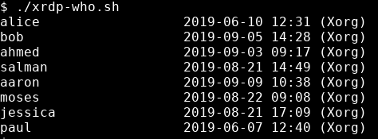
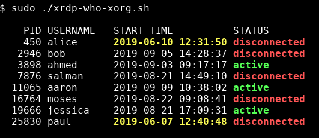

# xrdp-who
See who is logged in with xrdp

## Contents

### `xrdp-who.sh`

Print usernames and login times for xrdp users formatted like the output of the `who` command.

#### How it works

Determine who is logged in with xrdp by looking at the grandchildren processes of the `xrdp-sesman` service. The second (relative to each child) grandchild process should be the session backend executable.

I have only tested this with the Xorg and Xvnc backends.

### Backend-specific scripts

These scripts provide more detail, including whether a session is currently active or disconnected, and don't mimic the output of the `who` command.

Backend | Script
--------|-----------------
Xorg    | xorg-who-xorg.sh
Xvnc    | xorg-who-xvnc.sh

The command used in the scripts to determine whether sessions are active or disconnected requires elevated permissions to produce correct results. (I.e. use `sudo` or run as root.)

